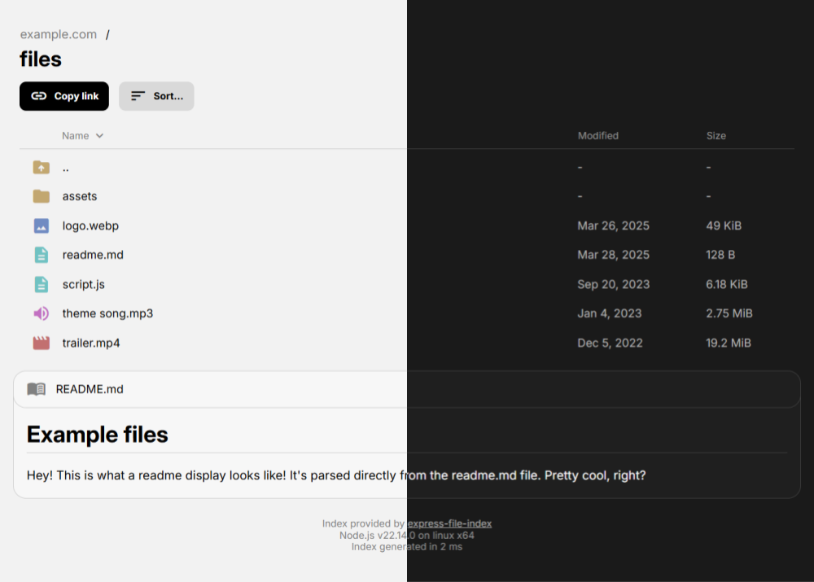

# Express File Index

`express-file-index` is an Express middleware that serves static files and provides a navigable file index for directories. It's designed to be lightweight, customizable, and easy to integrate into existing Express apps.



## Features

- **Static File Serving**: Serves files directly from the specified root directory.
- **Directory Indexing**: Displays a navigable file index for directories.
- **Customizable UI**: Use the built-in EJS template or provide your own.
- **Sorting Options**: Sort files by name, size, or modification date.
- **Hidden Files**: Hide files with specific prefixes from the index.
- **Zip Downloads**: Optionally allow downloading directories as zip archives.
- **Recursive Directory Stats**: Calculate accurate sizes and modification times for directories.
- **Readme Display**: Parse and display README.md files in directories.

## Installation

Install the package using npm:

```bash
npm install express-file-index
```

## Usage

Here's an example of how to use `express-file-index` in an Express application:

```javascript
const express = require('express');
const index = require('express-file-index');

const app = express();

app.use(index({
    rootDir: './public',
    serverName: 'Example Files',
    allowZipDownloads: true,
    statDirs: true
}));

app.listen(3000, () => {
    console.log('Server is running on http://localhost:3000');
});
```

## Configuration

The middleware accepts an options object to customize its behavior. Below are the available options:

### Options

| Option               | Type       | Default Value | Description                                                                 |
|----------------------|------------|-----------------------|-----------------------------------------------------------------------------|
| `rootDir`            | `string`   | `'./'`                | The root directory of the file index.                                      |
| `serverName`         | `string`   | Hostname of the server| The name to use for the root directory in the file index.                  |
| `hiddenFilePrefixes` | `string[]` | `[ '.', '_' ]`        | File prefixes to hide from the file index.                                 |
| `indexFiles`         | `string[]` | `[ 'index.html' ]`    | Files to serve on directory requests instead of the file index.            |
| `statDirs`           | `boolean`  | `false`               | Whether to recursively calculate directory sizes and modification times.   |
| `allowZipDownloads`  | `boolean`  | `false`               | Whether to allow downloading directories as zip archives.                  |
| `ejsFilePath`        | `string`   | Built-in template     | Path to a custom EJS template for the file index.                          |
| `fileTimeFormat`     | `string`   | `'MMM D, YYYY'`       | Format for displayed file modification times (uses Day.js format).         |
| `enableReadmes`      | `boolean`  | `true`                | Whether to parse and display README.md files in the file index.            |

## Customization

You can customize the file index UI by providing your own EJS template file via the `ejsFilePath` option. The following data is available as properties under the `data` object:

- `serverName`: The name of the server.
- `ancestors`: An array of parent directories., each with `name` and `path` properties.
- `dir`: An object describing the current directory, with the same format as an `ancestors` item.
- `files`: A sorted array of files and directories in the current directory. Each entry contains `name`, `path`, `isDirectory`, `size` (bytes), `modified` (ms timestamp), `type` (one of file, folder, text, image, audio, video, compressed, software), and `icon` (Google Material Symbol icon name) properties.
- `readmeHtml`: An HTML string parsed from the readme file, if one exists. `null` otherwise.
- `readmeFilePath`: The path to the readme.md file in the current directory if one exists. `null` otherwise.
- `sortType`: The current sort type (`name`, `size`, or `modified`).
- `sortOrder`: The current sort order (`asc` or `desc`).
- `fileTimeFormat`: The format to use for file modification times.
- `allowZipDownloads`: Whether zip downloads are enabled.
- `nodejsVersion`: The Node.js version.
- `osPlatform`: The operating system platform.
- `osArch`: The operating system architecture.
- `renderStartTime`: A millisecond timestamp representing the time the request was received.

## README.md Display

If the `enableReadmes` option is set to `true` (default), the middleware will look for a `README.md` file in each directory. If found, it will parse the file as Markdown and display it below the file index. The content is sanitized to prevent XSS attacks.

The following data is available for customizing the README display:

- `readmeHtml`: The sanitized HTML content of the README.md file.
- `readmeFilePath`: The path to the README.md file, or `null` if none exists.

To disable this feature, set `enableReadmes` to `false` in the options:

```javascript
app.use(index({
    rootDir: './public',
    enableReadmes: false
}));
```